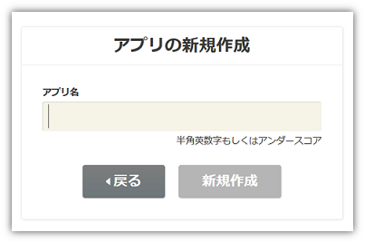
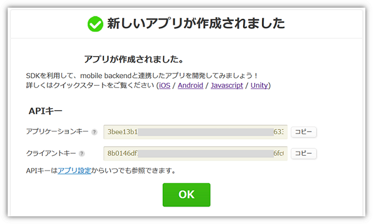
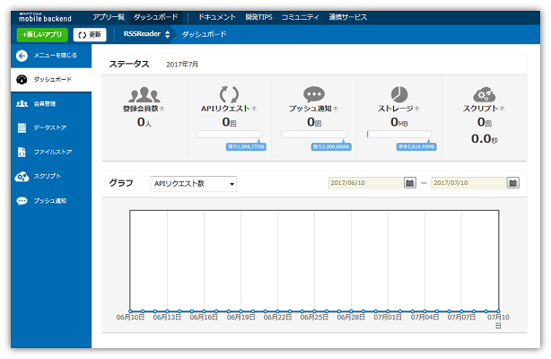
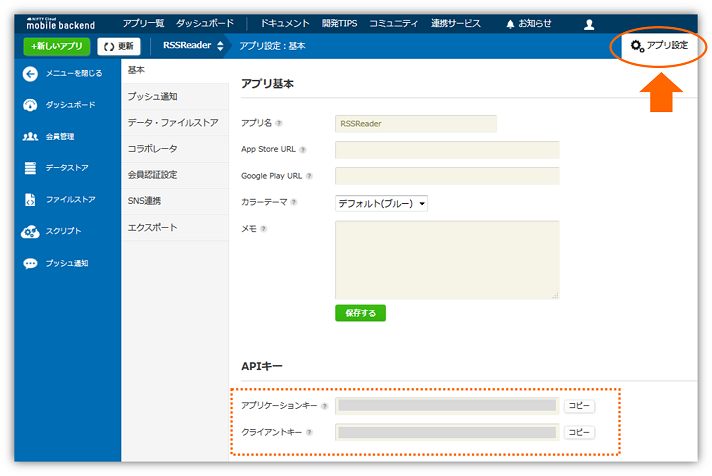

name: inverse
layout: true
class: center, middle, inverse
---
# 【Monaca × ニフティクラウド mobile backend】 Webコンテンツを スマホアプリ化をしよう！
ニフティ株式会社

.footnote[
20161215
]

---
layout: true
class: center, middle, inverse_sub
---
# はじめに

---
layout: false

## 本セミナーについて

.size_large_13[
### Monaca×mBaaS共催セミナー(全５回)

* 第１回　11/24（木）
 * __mBaaS基礎講座__
* 第２回　12/15（木）
 * __Webコンテンツをスマホアプリ化しよう！__ 
* 第３回　1/19 （木）
 * __プッシュ通知を始めよう！__
* 第４回　未定
 * 2月中旬開催予定
* 第５回　未定
 * 3月上旬開催予定
]

---
.footnote_right[
概要
]

## 概要
Monacaとニフティクラウド mobile backendを使うことで、**既存のWebコンテンツも簡単にスマホアプリ化することが可能** です。ここではその手順を解説します。

.center[]
.center[
__▼ 資料はこちらから入手できます ▼__

__.size_large_18[https://goo.gl/kVmQgR]__
]

---
.footnote_right[
概要
]
### 今回体験する内容
#### 既存のスマホ対応済みブログをスマホアプリ化します
* ブログのRSSからアプリの記事リストを構築します
* 記事本体はWebViewでブログ本体へ遷移させます
* ブログのお気に入り登録機能を追加します
 * お気に入り情報をクラウドに保存します
* アプリ側は「Monaca」を、バックエンド側は「mBaaS」を使用して簡単に実装します

.center[]

---
.footnote_right[
概要
]
### Monacaって何？
* __もなか 【[Monaca](https://ja.monaca.io/)】__ HTML5/JavaScript/CSS3でスマホアプリが開発できる開発環境。開発スタイル／コーディング環境は選択可能。

.center[]

---
.footnote_right[
概要
]
### ニフティクラウド mobile backend って何？
* __にふてぃくらうど-もばいる-ばっくえんど 【[ニフティクラウド mobile backend](http://mb.cloud.nifty.com/about.htm)】__ スマートフォンアプリに必要なバックエンド機能が開発不要で利用できるクラウドサービス。 クラウド上に用意された機能をAPIで呼び出すだけで利用できます。また、APIを簡単に使うためのSDKを用意しています（ iOS / Android / Monaca / Unity ）。mobile Backend as a Service の頭文字を取って、通称 **mBaaS** 呼ばれます。

.center[]

---
.footnote_right[
概要
]

### Monaca と mBaaS で サーバー連携アプリは簡単に実現可能に
この２つを組み合わせると、高度なアプリも簡単スピーディーに開発できます

.center[]

.left-column[
__《アプリ側》Monaca のすごいところ__
.size_small_7[
* 無料で使える！
* iOS / Android 同時に開発可能！
* いつでもどこでも、ブラウザで開発OK！
* **mBaaSのSDK導入** がクリックだけで簡単に！
]
]
.right-column[
__《サーバー側》mBaaS のすごいところ__
.size_small_7[
* 無料で使える！
* **バックエンドの開発・運用は一切不要**！
* データの保存はたった **３行** で実装可能！
* **プッシュ通知** も簡単実装！
* **コントロールパネル** からクラウドの状況をパッと確認できる！
]
]

---
layout: true
class: center, middle, inverse_sub
---
# ハンズオン

---
layout: false

## 準備
### 事前準備
下記登録を完了し、アカウントを作成しておいてください。
* [Monaca](https://ja.monaca.io/register/start.html)の利用登録（無料）
* [ニフティクラウド mobile backend (mBaaS)](http://mb.cloud.nifty.com/signup.htm)の利用登録（無料）

### 動作環境準備
* PC
 * Chrome 最新版
* 端末 ( iPhone / Android )
 * [Monacaデバッガー](https://ja.monaca.io/debugger.html) 最新版

---
.footnote_right[
.right[
手順
]
]

## ハンズオン
### 手順
.size_large_15[
1. Monacaの準備
1. 動作確認① MonacaでRSSリーダーを体験
1. mBaaSの準備
1. お気に入り機能をオンライン化する
1. 動作確認② クラウド連携したRSSリーダーを体験
]

* 今回はmBaaSとの連携部分をよりわかりやすく理解するために、コーディング済みのプロジェクトを用意しました！
* Monacaにプロジェクトをインポートして使用します

---
.footnote_right[
.right[
ハンズオン 1. Monaca準備
]
]

### 1. Monaca準備
* Monacaにログインをします

.center[]
https://ja.monaca.io/

---
.footnote_right[
.right[
ハンズオン 1. Monaca準備
]
]
 
* プロジェクトをインポートします
* 「Import Project」をクリックすると、「プロジェクトのインポート」画面が表示されます
* 「プロジェクト名」を入力します　例）.color_blue[__Webコンテンツのスマホアプリ化__]
* 「インポート方法」では、「URLを指定してインポート」を選択し、次のURLを入力します

　　　`https://github.com/natsumo/MonacaRssReaderApp/archive/master.zip`

.center[]

---
.footnote_right[
.right[
ハンズオン 1. Monaca準備
]
]
  
* プロジェクトが作成さてたら、「開く」をクリックします
* プロジェクトが開かれます

.center[]

これでMonacaの準備は完了です

---
.footnote_right[
.right[
ハンズオン 2. 動作確認① MonacaでRSSリーダーを体験
]
]
### 2. 動作確認① MonacaでRSSリーダーを体験
.center[]

---
.footnote_right[
.right[
ハンズオン 2. 動作確認① MonacaでRSSリーダーを体験
]
]
  

何も変更せずにMonacaデバッガーで動かしてみましょう。mBaaSのブログ（mBaaS活用術）が表示されます。

.center[]

* 星のマークをタップするとお気に入りの ON/OFF ができます

---
.footnote_right[
.right[
ハンズオン 2. 動作確認① MonacaでRSSリーダーを体験
]
]
## 　

お気に入りの情報はスマホのローカルストレージに保存されています。したがって、「お気に入り」情報は、自分にしか見られません。また、機種変更したら見られなくなってしまいます。

.center[]

---
.footnote_right[
.right[
ハンズオン 2. 動作確認① MonacaでRSSリーダーを体験
]
]
  
#### ローカルストレージからクラウドへ！mBaaSを導入しましょう！
* 自分のお気に入り情報をサーバーに上げて、共有する
* 他の人がどれくらいお気に入り登録しているかどうか

.center[]

---
.footnote_right[
.right[
ハンズオン 3. mBaaS準備
]
]
### 3. mBaaS準備
* mBaaS にログインします

.center[]
http://mb.cloud.nifty.com/

---
.footnote_right[
.right[
ハンズオン 3. mBaaS準備
]
]
 
* 新しいアプリを作成します
* アプリ名を入力し、「新規作成」をクリックします　例）.color_blue[__RSSReader__]

.center[]

* mBaaSを既に使用したことがある場合は、画面上方のメニューバーにある「+新しいアプリ」をクリックすると同じ画面が表示されます

.center[]

---
.footnote_right[
.right[
ハンズオン 3. mBaaS準備
]
]
  
* アプリが作成されるとAPIキー（２種類）が発行されます
 * APIキーは後で使用します。
* ここでは使用しないので、「OK」で閉じます

.center[]

---
.footnote_right[
.right[
ハンズオン 3. mBaaS準備
]
]
 
* ダッシュボードが表示されます

.center[]

* これでmBaaSの準備は完了です

---
.footnote_right[
.right[
ハンズオン 4. お気に入り機能をオンライン化する
]
]
### 4. お気に入り機能をオンライン化する
完成イメージ
.center[]

---
.footnote_right[
.right[
ハンズオン 4. お気に入り機能をオンライン化する
]
]
 
.size_large_11[
#### 作業手順
1. SDKの導入
2. APIキーの設定
3. 読み込むJavaScriptファイルの変更
4. コード解説（実装済み）
 * (1) SDKの初期化
 * (2) 保存先クラスの定義
 * (3) 保存するオブジェクトの生成
 * (4) お気に入り登録（保存）
 * (5) お気に入り登録解除（検索/削除）
 * (6) お気に入り登録人数表示（検索）
 * (7) ☆に色をつける（検索）
]

---
.footnote_right[
.right[
ハンズオン 4. お気に入り機能をオンライン化する
]
]
 
.size_large_11[
#### 作業手順
]
 
.center[]

---
.footnote_right[
.right[
ハンズオン 4. お気に入り機能をオンライン化する
]
]
.size_large_15[
#### 1. SDKの導入
]
* Monacaを開きます
* 上部メニューバーから「設定」＞「JS/CSSコンポーネントの追加と削除...」をクリックします
.center[]

---
.footnote_right[
.right[
ハンズオン 4. お気に入り機能をオンライン化する
]
]
  
* 「インストールしたコンポーネント」の右のテキストフィールドに「`ncmb`」と入力し、「検索」をクリックします

.center[]

---
.footnote_right[
.right[
ハンズオン 4. お気に入り機能をオンライン化する
]
]
* 「ncmbインストールされていません。」と表示されるので、「追加」をクリックします
* SDKのバージョンはそのまま（最新版を指定）で、「インストールの開始」をクリックします
* 「ローダーの設定」で「`components/ncmb/ncmb.min.js`」のチェックボックスにチェックを入れて「OK」をクリックします

.center[]

---
.footnote_right[
.right[
ハンズオン 4. お気に入り機能をオンライン化する
]
]
  
* 下記のように表示されればOKです！

.center[]

---
.footnote_right[
.right[
ハンズオン 2. SDKの初期化
]
]
.size_large_15[
#### 2. APIキーの設定
]
* `www/index.html`を開きます

.center[]

---
.footnote_right[
.right[
ハンズオン 2. APIキーの設定
]
]
  
* 「APIキーの設定」にmBaaSでアプリ作成時に発行されたAPIキーを設定します

.center[]

* mBaaS のダッシュボードから、APIキー（アプリケーションキーとクライアントキー）をコピーして、それぞれ`YOUR_NCMB_APPLICATION_KEY`と`YOUR_NCMB_CLIENT_KEY`に貼り付けます
* このとき、ダブルクォーテーション「`"`」は消さないように注意しましょう
* ここで設定したAPIキーを使って、SDKを初期化します（後ほど確認します）

---
.footnote_right[
.right[
ハンズオン 2. APIキーの設定
]
]
 
* APIキーはmBaaSのダッシュボード「アプリ設定」＞「基本」で確認できます

.center[]

---
.footnote_right[
.right[
ハンズオン 3. 読み込むJavaScriptファイルの変更
]
]
.size_large_15[
#### 3. 読み込むJavaScriptファイルの変更
]
* 同じく`www/index.html`を編集します

現在の状態は、ローカルストレージに保存する処理を実装した「`www/js/favorite-offline.js`」を読み込んでいます。これをmBaaSに保存する処理を実装した「`www/js/favorite-online.js`」に読み込み先を変更する必要があります。

* 12行目のコードを下図のように編集します

.center[]

---
.footnote_right[
.right[
ハンズオン 3. 読み込むJavaScriptファイルの変更
]
]
  
今回は実装が完了したものを使用しますので、作業は以上です。

#### 作業が完了したら保存を忘れずに！
* メニューバーの「保存」をクリックします
 * Windowsの場合は、「Ctrl + S」でも保存できます
 * Macの場合は、「Command + S」でも保存できます

---
.footnote_right[
.right[
ハンズオン 4. コード解説
]
]
.size_large_15[
#### 4. コード解説
]
実装内容を確認していきます

* Monacaを開いて、`www/js/favorite-online.js`ファイルを開きます

.center[]

---
.footnote_right[
.right[
ハンズオン 4. コード解説
]
]
   
完成イメージ（再掲）

 
.center[]

---
.footnote_right[
.right[
ハンズオン 4. コード解説
]
]
.size_large_11[
##### (1) SDKの初期化
]
mBaaSのSDKを使う場合は必ず行う処理です
.center[]
.size_large_11[
##### (2) 保存先クラスの定義
]
☆をタップするとお気に入り登録ができます。そのデータの保存先クラス`favorite`をここで定義しています
.center[]
.size_large_11[
##### (3) 保存するオブジェクトの生成
]
.center[]

---
.footnote_right[
.right[
ハンズオン 4. コード解説
]
]
.size_large_11[
##### (4) お気に入り登録（保存）
]
(3)で生成したオブジェクトに`.set(key, value)`で値を設定します。ここでは誰が(who)、どの記事を(where)を保存したかを記録するため、自分（端末）の`uuid`（ユニークユーザーID）と登録したい記事の`URL`を設定します。`.save()`で保存します。処理が成功した場合`.then`、失敗した場合`.catch`の処理が実行されます。また、処理はドットチェーンで書くことができます。

.center[]

---
.footnote_right[
.right[
ハンズオン 4. コード解説
]
]
.size_large_11[
##### (5) お気に入り登録解除（検索/削除）
]
☆をもう一度タップするとお気に入り登録を解除することができます。該当のデータを検索し、削除を行います。`equalTo(key, value)`で自分（端末）の`uuid`（ユニークユーザーID）と削除したい記事の`URL`に一致するデータを、`fetch()`で検索します。
検索に成功した場合(then)に、`delete()`で削除を行っています。

.center[]

---
.footnote_right[
.right[
ハンズオン 4. コード解説
]
]
.size_large_11[
##### (6) お気に入り登録人数表示（検索）
]
各記事の登録人数を数えるには、`equalTo(key, value)`で`URL`のみを指定し、`.count()`で数えて、`.fetchAll()`で全件検索を行います。

.center[]

---
.footnote_right[
.right[
ハンズオン 4. コード解説
]
]
.size_large_11[
##### (7) ☆に色をつける（検索）
]
自分自身がお気に入り登録した記事には☆に色を付けます。
自分（端末）の`uuid`（ユニークユーザーID）と記事の`URL`のセットに合致するデータを`count()`で数えて、`fetchAll()`で全件検索します。その値が`0`より大きい場合に☆に色を付けています。

.center[]

---
.footnote_right[
.right[
ハンズオン 5. 動作確認②
]
]
### 5. 動作確認②
* 再びMonacaデバッガーを起動し、MonacaとmBaaSの連携を確認しましょう

.center[]

* ☆をタップしたら、mBaaSのダッシュボードを確認しましょう

---
.footnote_right[
.right[
ハンズオン 5. 動作確認②
]
]
.size_large_13[
#### mBaaSのダッシュボードを確認
]
* 下図のように情報が保存されます
 * １つのお気に入り登録に対して、１つのデータが保存されます。したがって、☆の数が増えると、mBaaSに保存されたデータも増えます。

.center[]

* 個人（端末）を表す`uuid`と記事の`URL`が登録されていることが確認できます

---
.footnote_right[
.right[
ハンズオン 5. 動作確認②
]
]
.size_large_13[
#### mBaaSのダッシュボードからデータを編集
]
データを編集して、「ダミーユーザー」のデータを作ってみましょう。

* 任意のデータの「`uuid`」を１つ選択し、適当な文字列に置き換えます

.center[]

---
.footnote_right[
.right[
ハンズオン 5. 動作確認②
]
]
 
* デバッガーを見てみましょう
* 画面右上の「Reload」ボタンをタップして画面を更新します
 * 違うユーザーがお気に入り登録した状態なので、☆の色が消えます。

.center[]

---
## まとめ
.size_large_13[
.center[__既存Webコンテンツのスマホアプリ化を体験しました！__]

* サーバー連携したアプリは Monaca × mBaaS で簡単に実現可能であることがわかった◎
 * MonacaもmBaaSも会員登録＆ログインですぐ使える！
 * mBaaSのSDK導入はクリックだけで完了！
 * データの保存だけならわずか３行で実装可能！
 * ドットチェーンで書けるから、処理の流れがわかりやすい！
]

---
layout: true
class: center, middle, inverse_sub
---
# おわりに

---
layout: false

## おわりに
いかがでしたでしょうか？こんなに使いやすくて便利なmBaaSをもっと活用してみたい方へ、mBaaSの各機能をすぐに試すことができるサンプルアプリを多数ご用意しています。Monacaにサンプルプロジェクトをインポートして、簡単な操作をするだけですぐにお試しいただけます！ぜひご活用ください。

.size_large_11[
* [mobile backend を体験しよう！](https://github.com/NIFTYCloud-mbaas/monaca_data_registration)
 * 使用機能 / データストア
* [アプリにログイン機能をつけよう！](https://github.com/NIFTYCloud-mbaas/monaca_login_template)
 * 使用機能 / 会員管理
* [アプリにプッシュ通知を組み込もう！](https://github.com/NIFTYCloud-mbaas/MonacaPushApp)
 * 使用機能 / プッシュ通知
* [地図アプリを作ろう！](https://github.com/NIFTYCloud-mbaas/MonacaMapApp)
 * 使用機能 / データストア,位置情報検索
* [and more...](http://mb.cloud.nifty.com/doc/current/tutorial/tutorial_monaca.html)
]

---
.size_large_13[
### お知らせ 第３回Monaca×mBaaS共催セミナー
]
.center[
.size_large_13[
2017年1月19日(木)開催予定
]
.size_large_20[
__「プッシュ通知を始めよう！」__
]
]

.left-column[
* Monacaで作成したアプリにプッシュ通知を組み込む方法をご案内します
* Monaca×mBaaSで高速プッシュ通知機能導入を体験いただけます
]
.right-column[
.center[

]
]

---
## 本日の資料はこちらから入手できます
Monacaとニフティクラウド mobile backendを使うことで、**既存のWebコンテンツも簡単にスマホアプリ化することが可能** です。

.center[]
.center[
__.size_large_20[https://goo.gl/kVmQgR]__
]
---
layout: true
class: center, middle, inverse_sub
---
.center[
## ニフティとなら、きっとかなう。 With Us, You Can.
]
